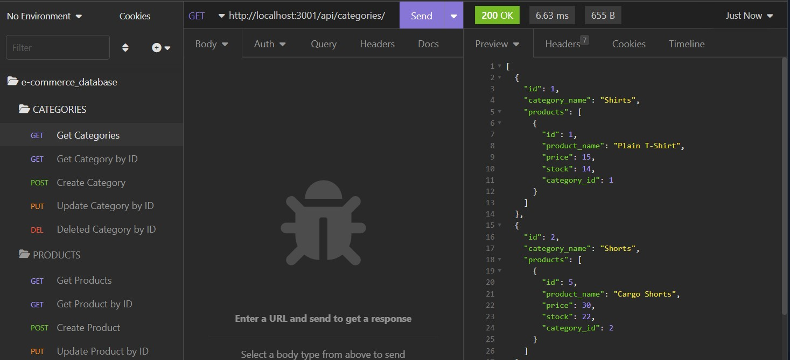

# E-Commerce_Database
 

  
## Description
  
A back end e-commerce application that uses databases technology to get, create, update, and delete data related to the e-commerce products 

## Table of Contents

  - [Installation](#Installation)
  - [Usage](#Usage)
  - [License](#License)
  - [Contrubutions](#Contributions)
  - [Test](#Test)
  - [Questions](#Questions)

## Installation

No installation needed. Need to start the application from Git Bash or terminal and use Insomnia to navigate through the different routes.
This application requires the following packages:
- [nodejs](https://nodejs.org/en/)
- [MySQL2 package](https://www.npmjs.com/package/mysql2)
- [express package](https://expressjs.com/)
- [sequelize package](https://www.npmjs.com/package/sequelize)
- [dotenv package](https://www.npmjs.com/package/dotenv)

## Usage

[Walkthrough video](https://drive.google.com/file/d/1IhosVMaQzrJTGio9I39wO_WP4cweiFUK/view?usp=sharing)

Start by adding database name, MySQL username and password to an environment variable file. Also need to create the database by running "source schema_db and seed the database. Then need to start the application with "node server.js". When the server started, you can open API GET routes in Insomnia to get categories, products or tags to get a json object with the data requested by each route. You cal also Post, Put and delete data. 

## Credits

- express Documentation
- dotenv Documentation
- mysql Documentation
- sequelize Documentation
- Stack Overflow

## License

This project is licensed under the MIT license.

## Contributing

No contributions Guidelines

## Test

No test available

## Questions

[github.com/FranklynSuriel](https://github.com/FranklynSuriel)

Questions about this project or to report an issue can be sent to:
fsuriel@gmail.com. Please specify the name of the project in the subject of the email.
